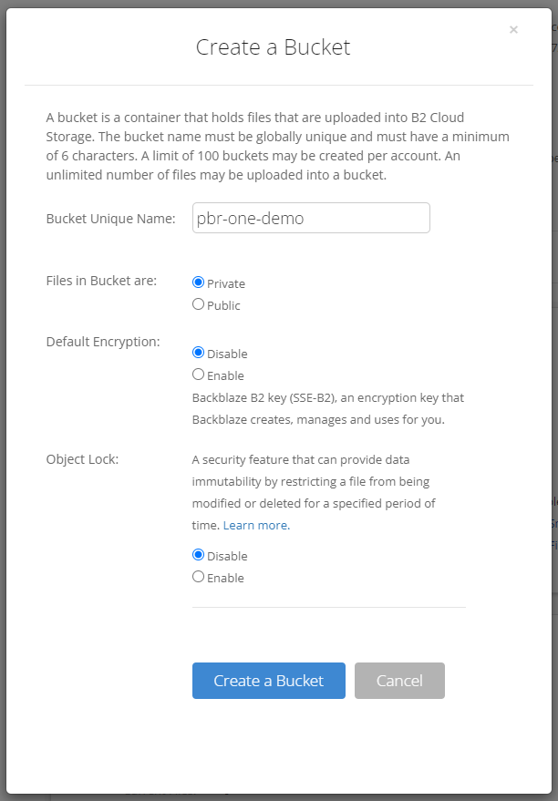
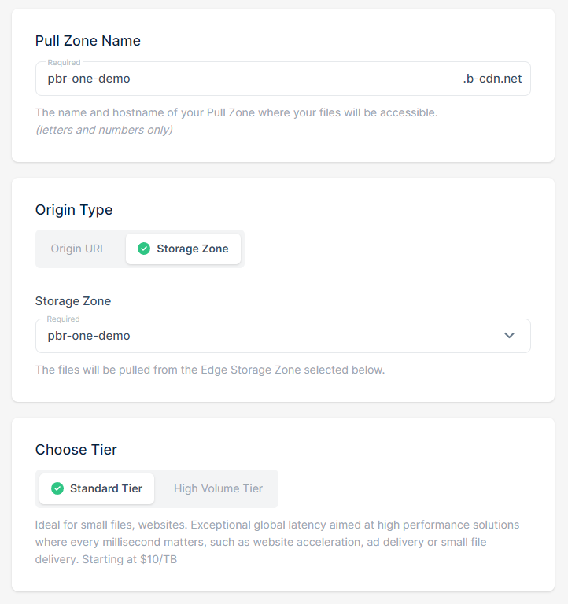
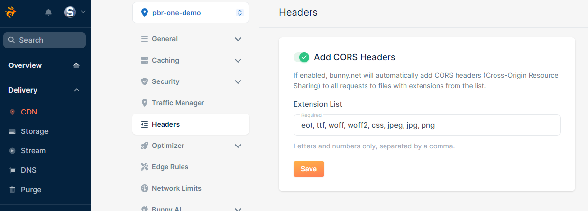

# Setup & Hosting
Setting up PBR.ONE previews requires consists of three main tasks:

- Hosting the code for PBR.ONE.
- Hosting the media files you want to preview.
- Integrating the preview into a website.

All of them can be achieved in multiple different ways that vary in complexity and flexibility.

This guide outlines ways for both artists with limited development experience as well as more experienced developers to get things going.

## Hosting the Code
For the preview to work, the source files of PBR.ONE need to be accessible online.

### Option A: Content Delivery Network (Easiest)
The simplest way of accessing PBR.ONE is to use the CDN (Content Delivery Network) provided by PBR.ONE itself.
All files for all versions of PBR.ONE are available and can be linked via the following URL:
```
https://cdn.pbr.one/<version>/<file>
```
You can check the [GitHub releases page](https://github.com/struffel/PBR.ONE/releases) to choose a version.
For example, here is version 0.4.0 of the HDRI shading preview:
```
https://cdn.pbr.one/0.4.0/hdri-shading.html
```
<iframe src="https://cdn.pbr.one/0.4.0/hdri-shading.html" style="border:none;border-radius:3px;width:100%;height:400px;" ></iframe>
### Option B: Self-Hosting (More flexible)
You can host PBR.ONE by simply uploading the files as static assets to your own hosting solution. No backend (Node/PHP/etc.) is required.

1. Clone the latest version of the repository (`git clone github.com/struffel/PBR.ONE`) or download a specific release from the [releases page](https://github.com/struffel/PBR.ONE/releases).
2. Upload the contents of the `/src` subfolder to a subdirectory like `/preview` on your web server or static file hosting solution of choice (AWS S3, Backblaze B2, etc.).

## Hosting the Preview Media

In addition to PBR.ONE itself the media you want to preview needs to find its way on the internet as well.
Again, there are many options of achieving this:

### Option A: Imgur (Easy to get started, but does not scale)

If you are just trying out PBR.ONE or only want to create a handful of previews in the first place then the free image hosting service [Imgur](https://imgur.com) is an easy way to get started.
**Though you probably want to upgrade to something else once you plan to create more previews, because this method will get pretty tedious.**

!!! note
	Imgur can only be used for the maps of PBR materials, they do not support high dynamic range formats.

Simply upload the maps you wish to preview into [a new album like this](https://imgur.com/a/SqLfYyX).
Then right-click each image and open it in a new tab. Make sure that the URL ends in `.jpg`, `.jpeg` or `.png`, like this:
```
https://i.imgur.com/yd0OOx7.jpg
```

Take the URL of every image and assemble your URL.
A detailed list of all possible parameters can be found in the next section.
For now you can take this URL as a reference:
```
# Example using cdn.pbr.one.
# You can leave out parameters, like the AmbientOcclusion map.
https://cdn.pbr.one/0.4.0/material-shading.html#color_url=https://i.imgur.com/yd0OOx7.jpg&ambientocclusion_url=https://i.imgur.com/y9P6ce4.jpg&displacement_url=https://i.imgur.com/C2khofQ.jpg&normal_url=https://i.imgur.com/HYYS9tZ.jpg&roughness_url=https://i.imgur.com/ouTJ5jn.jpg
```
Open it in your browser and look at the result:

<iframe style="border:none;border-radius:3px;width:100%;height:400px;" src="https://cdn.pbr.one/0.4.0/material-shading.html#color_url=https://i.imgur.com/yd0OOx7.jpg&ambientocclusion_url=https://i.imgur.com/y9P6ce4.jpg&displacement_url=https://i.imgur.com/C2khofQ.jpg&normal_url=https://i.imgur.com/HYYS9tZ.jpg&roughness_url=https://i.imgur.com/ouTJ5jn.jpg" ></iframe>


### Option B: Self-Host (Harder, but more flexible)

If you have uploaded the source code to your own server then you can do the same with your media files. Just serve them in any other subdirectory to which you can then link.

If you want to host the images from a different domain than the PBR.ONE preview you need to allow *[Cross-Origin Ressource Sharing](https://en.wikipedia.org/wiki/Cross-origin_resource_sharing)*.

#### Apache
Add an entry for the CORS header to `httpd.conf`:
```
Header set Access-Control-Allow-Origin "*"
```

#### NGINX
Add a line for CORS to your `nginx.conf`:
```
add_header Access-Control-Allow-Origin "https://example.com"; # URL from which you host PBR.ONE
```

### Option C: On an external Service/CDN (Best for most use-cases)
You can use numerous hosting services to serve the materal maps for your preview - many of which have a free tier.
This has the advantage that you don't really need to take care of the hosting yourself and can upload many files at once with ease.
Just make sure that the service supports *[Cross-Origin Ressource Sharing](https://en.wikipedia.org/wiki/Cross-origin_resource_sharing)* to ensure that the images can be loaded even if the PBR.ONE preview is on a different domain than the media files.

Two (non-sponsored) suggestions for hosting solutions are explained in more detail below.

#### [Backblaze B2](https://www.backblaze.com/cloud-storage)

- Create an account on the [Backblaze website](https://www.backblaze.com/cloud-storage).
- Create a new bucket:

- Open the **CORS Rules** and allow access from `https://cdn.pbr.one` or whatever domain you are using to host PBR.ONE.

- You can then start uploading your image files, like on any other cloud storage service. Click on one in the file list to get the raw URL. Make sure the URL you get ends with the actual file extension, like `.jpg`.
#### [Bunny.net](https://bunny.net)
 - Create an account on [bunny.net](https://bunny.net)
 - In the dashboard, navigate to **Delivery** > **Storage** and add a new storage zone using the button in the top right corner. The exact settings like the storage tier do not matter for the core functionality of PBR.ONE but might effect the speed with which the media files are loaded.

 - Then navigate to **Delivery** > **CDN** and create a new pull zone using the button in the top right corner. Select the storage zone from the previous step as the origin. Choose tier and pricing zones as you wish, they do not effect the core functionality, only performance.

- Finally, navigate to **Delivery** > **CDN** > **(Your Pull Zone)** > **Headers** and expand the list with the file of file extensions with the extensions you are using, like `jpg` or `png`.

- You can then navigate to **Delivery** > **Storage** > **(Your Storage Zone)**  and start uploading files.


## Accessing and integrating PBR.ONE

Once you have the weblink for the PBR.ONE files (like `https://cdn.pbr.one`) and your own media files (like `https://example.com/preview/bricks_color.jpg`) you can start building previews using the parameter reference in the next chapter.

For example, you can create an iframe with the preview and add it to the HTML of your website:

```
<iframe
style="width:100%;height:500px;"
src="https://cdn.pbr.one/0.4.0/material-shading.html#
color_url=https://pbr.one/media/bricks_col.jpg&
normal_url=https://pbr.one/media/bricks_nrm.jpg&
roughness_url=https://pbr.one/media/bricks_rgh.jpg&
displacement_url=https://pbr.one/media/bricks_dsp.jpg"
></iframe>
```
<iframe 
style="width:100%;height:500px;" 
src="https://cdn.pbr.one/0.4.0/material-shading.html#
color_url=https://pbr.one/media/bricks_col.jpg&
normal_url=https://pbr.one/media/bricks_nrm.jpg&
roughness_url=https://pbr.one/media/bricks_rgh.jpg&
displacement_url=https://pbr.one/media/bricks_dsp.jpg"
></iframe>
